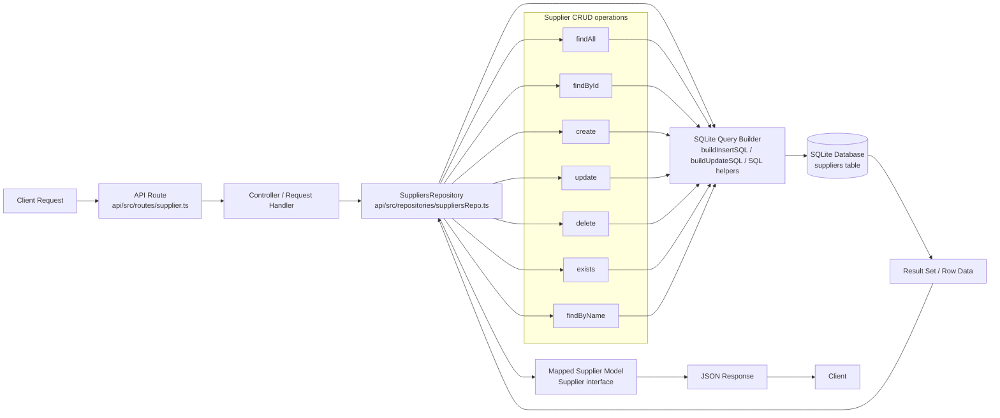

# Suppliers Module Data Flow

## Flow description

1. A client sends an HTTP request to the supplier API route.
2. The route handler validates the request and delegates to the repository layer.
3. The `SuppliersRepository` performs the appropriate database operation using SQLite helpers.
4. SQL is executed against the `suppliers` table in SQLite.
5. Returned rows are mapped back into supplier model objects.
6. The transformed result is sent back as JSON to the client.

## Source files

- Route: `api/src/routes/supplier.ts`
- Repository: `api/src/repositories/suppliersRepo.ts`
- Model: `api/src/models/supplier.ts`
- Database layer: `api/src/db/sqlite.ts`
- SQL utilities: `api/src/utils/sql.ts`
