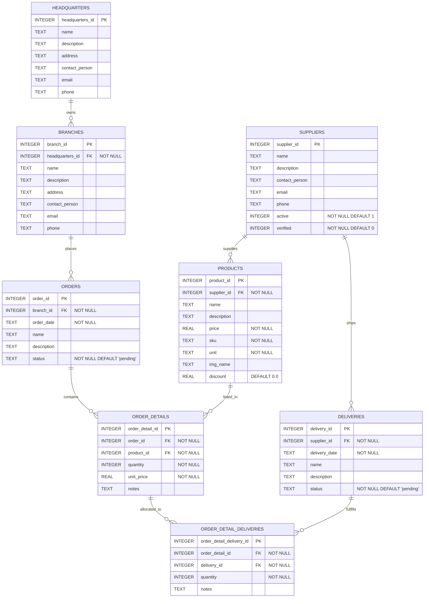

# Database Schema

This schema is derived from the SQLite migrations in `api/database/migrations/`.

## Relationship details

- `headquarters` to `branches`: one-to-many
  - Each branch belongs to exactly one headquarters.
  - One headquarters can manage many branches.

- `suppliers` to `products`: one-to-many
  - Each product is supplied by one supplier.
  - One supplier can provide many products.

- `suppliers` to `deliveries`: one-to-many
  - Each delivery is associated with one supplier.
  - One supplier can have many deliveries.

- `branches` to `orders`: one-to-many
  - Each order is placed by one branch.
  - One branch can place many orders.

- `orders` to `order_details`: one-to-many
  - Each order detail belongs to one order.
  - One order can contain many order detail entries.

- `products` to `order_details`: one-to-many
  - Each order detail references one product.
  - One product may appear in many order details across different orders.

- `order_details` to `deliveries` via `order_detail_deliveries`: many-to-many through join table
  - Each order detail can be linked to multiple deliveries.
  - Each delivery can fulfill multiple order detail entries.
  - `order_detail_deliveries` stores the `quantity` and optional `notes` for each link.

## Referential integrity

All foreign keys use SQLite foreign key constraints and are configured with cascade behavior on delete for the parent-child relationships:

- `branches.headquarters_id` -> `headquarters.headquarters_id` on delete cascade
- `products.supplier_id` -> `suppliers.supplier_id` on delete cascade
- `orders.branch_id` -> `branches.branch_id` on delete cascade
- `order_details.order_id` -> `orders.order_id` on delete cascade
- `order_details.product_id` -> `products.product_id` on delete cascade
- `deliveries.supplier_id` -> `suppliers.supplier_id` on delete cascade
- `order_detail_deliveries.order_detail_id` -> `order_details.order_detail_id` on delete cascade
- `order_detail_deliveries.delivery_id` -> `deliveries.delivery_id` on delete cascade
